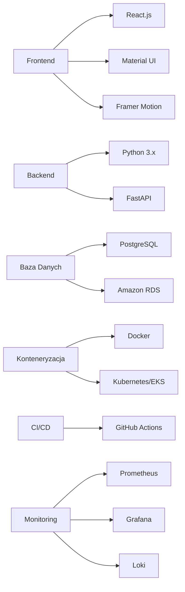

# 🎰 SlotBazaar: Platforma Kasyna Online 🎰

  
  
  
  *Nowoczesna platforma kasyna z matematycznie zbalansowanymi grami*
  
  
  
  
  
  

---

## 📋 Przegląd Projektu

SlotBazaar to kompleksowa platforma kasyna online oferująca 10 matematycznie zbalansowanych gier, zbudowana w architekturze mikroserwisowej i wdrożona na AWS przy użyciu Kubernetes (EKS).

---

## ✨ Kluczowe Funkcje

| 🔑 Funkcja | 📝 Opis |
|------------|---------|
| 🎮 **10 Gier Kasynowych** | Obejmuje Rzut Monetą, Rzut Kością, Ruletkę, Blackjack i wiele więcej |
| ⚖️ **Matematycznie Uczciwe** | Wszystkie gry skalibrowane do 95-97% RTP (Return to Player) |
| 👤 **Zarządzanie Użytkownikami** | Rejestracja, uwierzytelnianie, zarządzanie saldem |
| 💰 **System Transakcyjny** | Kompletna historia zakładów, wygranych i zmian salda |
| 📱 **Responsywny UI** | Nowoczesny interfejs Material UI z React |
| 🧩 **Architektura Mikroserwisowa** | Skalowalny backend zbudowany z FastAPI |

---

## 🛠️ Stos Technologiczny

### Frontend
- ⚛️ **React.js** z Material UI
- 🎭 Animacje Framer Motion
  
### Backend
- 🐍 **Python 3.x** z frameworkiem FastAPI
  
### Baza Danych
- 🐘 **PostgreSQL** (Amazon RDS)
  
### Infrastruktura
- 🐳 **Docker** i Kubernetes (EKS)
- 🔄 **CI/CD**: GitHub Actions
- 📊 **Monitoring**: Prometheus, Grafana, Loki

---

## 🎲 Portfolio Gier

  
| # | 🎮 Gra | 🎯 Opis | 💹 RTP |
|---|--------|--------|--------|
| 1 | **Rzut Monetą** | Klasyczna gra orzeł/reszka | 96% |
| 2 | **Rzut Kością** | Zakład na konkretną liczbę z 6-ściennej kości | 95% |
| 3 | **Prosta Ruletka** | Europejski styl z zakładami Czerwone/Czarne | 97,3% |
| 4 | **Wysoka/Niska Karta** | Przewidywanie czy następna karta będzie wysoka czy niska | 96% |
| 5 | **Koło Fortuny** | Kręć kołem, aby wygrać różne nagrody | 95% |
| 6 | **Automat 3-bębnowy** | Klasyczny automat z 3 symbolami | 96,3% |
| 7 | **Kamień Papier Nożyce** | Gra przeciwko kasynu | 97% |
| 8 | **Zgadnij Liczbę (1-10)** | Zgadnij prawidłową liczbę | 95% |
| 9 | **Zdrapka** | Wirtualna zdrapka z natychmiastowymi nagrodami | 96% |
| 10 | **Uproszczony Blackjack** | Gra karciana przeciwko krupierowi | 97,3% |

---

## 🏗️ Architektura

- 🚪 **API Gateway**: Punkt wejścia dla zewnętrznych żądań z uwierzytelnianiem
- 🧩 **Mikroserwisy Gier**: Każda gra zaimplementowana jako osobna usługa
- 💾 **Warstwa Bazy Danych**: Współdzielony PostgreSQL dla historii gier i danych użytkowników
- ☸️ **Orkiestracja Kubernetes**: Zarządza cyklem życia kontenerów i skalowaniem
- 📈 **Stos Monitoringu**: Wizualizacja metryk i logów w czasie rzeczywistym

---

## 🚀 DevOps i Wdrożenie

- 📝 **Infrastruktura jako Kod**: Zasoby AWS zarządzane przez Terraform
- 📦 **Konteneryzacja**: Każda usługa spakowana jako kontener Docker
- ☸️ **Kubernetes (EKS)**: Orkiestracja kontenerów dla wysokiej dostępności
- 🔄 **Pipeline CI/CD**: Zautomatyzowane testowanie, budowanie i wdrażanie
- 📊 **Monitoring**: Metryki wydajności i alerty w czasie rzeczywistym

---

## 🔒 Funkcje Bezpieczeństwa

- 🔑 Uwierzytelnianie oparte na JWT
- 💰 Bezpieczne zarządzanie saldem
- 🎲 Kryptograficznie bezpieczne generowanie liczb losowych
- 📜 Logowanie transakcji i historia

---

## 💼 Zalety Biznesowe

> *"SlotBazaar łączy uczciwą rozgrywkę z nowoczesną technologią, zapewniając najlepsze wrażenia z gry"*

- ⚖️ Matematycznie uczciwe gry (95-97% RTP)
- 📈 Skalowalna architektura obsługująca skoki ruchu
- 📊 Kompleksowa historia transakcji
- 🎨 Nowoczesny, angażujący interfejs użytkownika
- 🧩 Łatwość dodawania nowych gier do platformy

---

  
  **SlotBazaar** © 2025
  
  *Odpowiedzialna rozrywka dla świadomych graczy*
  

